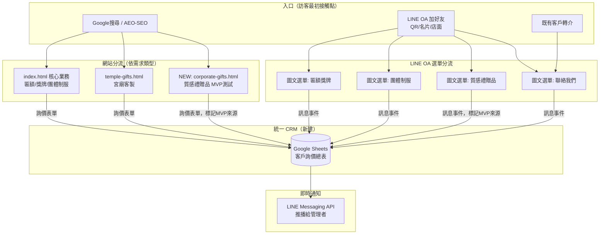

# 三才實業 — LINE OA / Web 整合漏斗架構規劃
> 建立日期：2026-08-11

## 0. 現況盤點（規劃前先釐清底層真的有什麼）

| 項目 | 現況 |
|---|---|
| 網站 | GitHub Pages 靜態站，`index.html`（核心業務：匾額/獎牌/團體制服）+ `temple-gifts.html`（宮廟客製獨立landing page，已存在的先例） |
| LINE OA | `@669vddce` 已建立，已串在網站 footer 連結 + 全域懸浮按鈕 |
| 自動化後端 | GCP `n8n-server`（`san-tsair-automation` 專案，e2-micro 免費額度）+ Caddy 反向代理，`https://n8n.8-229-67-29.sslip.io`（2026-08-11 剛修好，見上方對話紀錄） |
| 現有詢價流程 | 網站表單 → n8n webhook → LINE Messaging API 推播給管理者手機（單向通知，尚無 CRM 存檔） |
| 禮贈品 MVP 專案 | `gift-suppliers/`（本機、gitignore、不進版控）：20家供應商盡調、10項零庫存測試商品、第一梯隊8家廠商話術 |
| 決策 | 兩個業務線（既有核心業務 + 禮贈品MVP）整合成同一個漏斗，用不同路徑/選單分流，不做成兩個獨立系統 |

## 1. 漏斗總覽

**核心原則：所有入口最終匯入同一張 CRM 表，用「來源欄位」分流，而不是拆成兩套系統。**
這樣禮贈品 MVP 測試的「正向回覆率」（HANDOFF.md 訂的判斷門檻：≥15% 且至少1家要求樣品才進正式詢價）跟既有業務的詢價量，可以在同一份報表裡分開看，也可以合併看整體轉換。

## 2. 網站端：新增 `corporate-gifts.html`

- 定位：對應 `gift-suppliers/` 的 10 項 MVP 測試商品，公開版只放「商品照片/賣點故事/測試售價/CTA」，**不放**供應商聯絡方式、盡職調查、風險評估、正向回覆率等內部資料（那些留在 `gift-suppliers/` 私有目錄，這條界線上次已經在 `.gitignore` 定過）。
- 沿用 `temple-gifts.html` 已經驗證過的「獨立 landing page + 專屬 OG/Schema」模式，不用重新發明。
- CTA 統一導到同一個 `#contactForm`，但**多帶一個隱藏欄位 `source=corporate-gifts`**，讓 n8n 寫入 CRM 時能標記這筆詢價是從禮贈品 MVP 頁面來的。
- 素材可直接用 `gift-suppliers/output/snapshots/` 和 `gift-suppliers/samples/公開型錄/` 裡已有的圖，不用重拍。

## 3. LINE OA：圖文選單 + 分流

目前 LINE OA 只有「加好友歡迎訊息」草案（見 `docs/line_gcp_deployment.md`），還沒有圖文選單、沒有分類流程。建議：

1. **圖文選單（Rich Menu）**：4 格 — 匾額獎牌 / 團體制服 / 質感禮贈品 / 聯絡我們。點擊後用 Quick Reply 或直接跳轉對應網站頁面。
2. **加好友歡迎訊息**：文案已有草案，補上「請問您想了解哪類產品？」+ Quick Reply 按鈕對應 4 分類。
3. **inbound 訊息 → n8n**：目前 n8n 只有「網站表單 → LINE 推播」單向流程，**沒有**「LINE 訊息 → n8n」的反向 webhook。要接起來需要：
   - LINE Developers Console 設定 Webhook URL：`https://n8n.8-229-67-29.sslip.io/webhook/line-inbound`
   - 需要 **Channel Secret**（驗證訊息簽章用，跟 Channel Access Token 不同東西，也要你去 LINE Developers Console 拿）
   - 新建一支 n8n workflow：LINE Webhook → 解析事件類型（加好友/訊息）→ 依關鍵字或選單點擊分類 → 寫入 CRM + 自動回覆

## 4. CRM：Google Sheets（新建，用 Service Account 免 OAuth 互動）

原始規劃（`docs/n8n_flow.md`）就有 Google Sheets CRM 的構想，但從未真的接上（只有 LINE 推播，沒有存檔）。這次一併補上：

- 我可以用手上已有的 GCP 存取權限（`san-tsair-automation` 專案）建立一個 Service Account，產生金鑰後匯入 n8n 的 Google Sheets 憑證 — **這樣你不用跑 Google OAuth 同意畫面**，全程我可以直接處理完。
- 表格欄位：時間、來源（核心業務/宮廟/禮贈品MVP/LINE OA）、客戶姓名、電話、需求項目、預計數量、詳細說明、處理狀態。
- 這張表之後也能對應 `gift-suppliers/data/` 主檔裡「MVP測試清單」的「正向回覆」「樣品需求」「正向率」欄位，用篩選/樞紐分析就能算出來，不用手動對帳。

## 5. 分階段執行順序

| 階段 | 內容 | 誰做 | 狀態 |
|---|---|---|---|
| 0 | 修復 webhook 404 + HTTPS 混合內容問題 | 我 | ✅ 2026-08-11 已完成並測試 |
| 1 | 取得 LINE Channel Access Token + 你的 User ID，接上真實推播 | 你（登入LINE Developers Console） | 待辦 |
| 2 | 建立 Google Sheets CRM + Service Account 自動接上 n8n | 我 | 待你同意後開始 |
| 3 | 新增 `corporate-gifts.html`（禮贈品MVP公開版landing page） | 我 | 待你同意後開始 |
| 4 | LINE OA 圖文選單 + 歡迎訊息 quick reply | 你在LINE後台設定畫面點，我先給文案/圖 | 待辦 |
| 5 | 取得 Channel Secret，建 LINE inbound webhook workflow | 你提供金鑰 + 我建workflow | 待辦 |
| 6（可選，之後再說）| 導流優化：UTM 追蹤、各來源轉換率報表 | 我 | 尚未規劃細節 |

## 6. 這次規劃刻意不做的事

- **不**把 `gift-suppliers/` 私有資料直接接進網站或 CRM — 供應商聯絡窗口、報價、盡調評估永遠留在本機私有目錄，這是上次已經定調的紅線。
- **不**把兩條業務線拆成兩個獨立網站/兩支 LINE OA — 你選的是整合成一個漏斗，用來源欄位分流即可，避免維運兩套系統的負擔。
- **不**現在就做付費廣告/再行銷（第6階段），先把免費流量的入口跟資料回收管線做穩，有轉換率數據再談要不要加碼。
