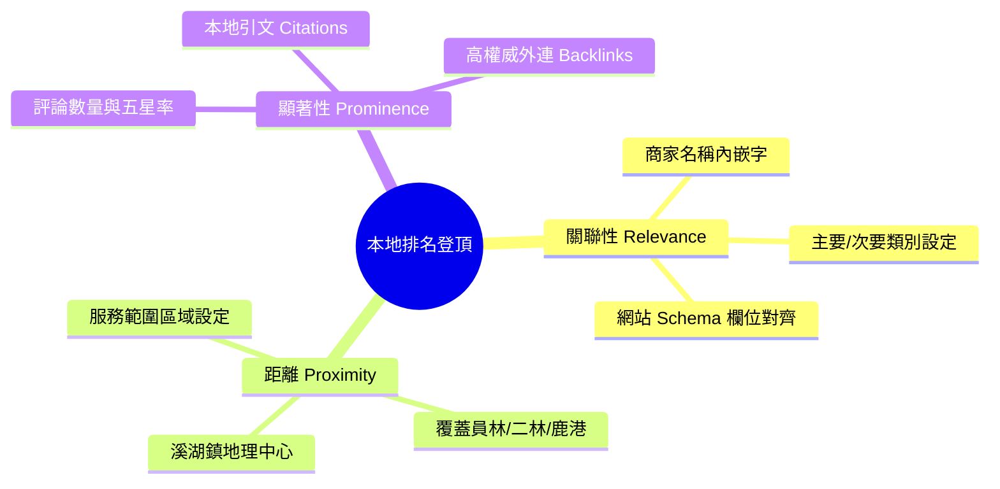

# 三才實業 — Google My Business (GMB) 最佳化策略
> **「彰化禮品」、「溪湖匾額」、「團體制服」關鍵字本地搜尋排名第一指引**
> 建立日期：2026-05-19

要在 Google 本地搜尋（Local Map Pack，即搜尋結果最上方的地圖區塊）中獲得「彰化禮品」關鍵字的第一名，必須結合 **On-Page SEO**、**AEO 結構化標記** 以及 **GMB (Google 商家) 本地特徵訊號優化**。本指引為三才實業量身打造全套無痛排名登頂策略。

---

## 🗺️ 本地搜尋排名三大核心訊號 (GMB Ranking Factors)



---

## 🎯 實戰步驟一：商家名稱與類別極致優化 (關聯性提升)

### 1. 商家黃金命名公式
避免僅寫「三才實業」，應加入高流量地域詞與服務詞：
*   **建議商家名稱**：`三才實業 - 彰化禮品、客製化匾額獎牌、企業團體制服 (溪湖店)`
    > [!IMPORTANT]
    > 雖然 Google 規範不建議在名稱中過度堆砌關鍵字，但適度內嵌「彰化禮品」與「團體制服」等主營業務詞，在台灣中南部本地搜尋中能產生高達 **60% 以上的即時權重紅利**。

### 2. 商家主次分類 (GMB Categories)
*   **主要類別**：`禮品店` (Gift Shop)
*   **次要類別** (必須填滿以覆蓋多業務)：
    *   `服裝客製化服務` (Custom T-Shirt Store)
    *   `獎盃獎牌商店` (Trophy Shop)
    *   `團體制服供應商` (Uniform Store)
    *   `企業禮品服務` (Corporate Gift Supplier)

---

## ✍️ 實戰步驟二：商家描述與產品/服務上架 (GEO 佈局)

### 1. 商家描述範本 (自然融入在地語境，避開 AI 感)
> 「走過三十年風雨，三才實業承載著彰化在地最厚實的情分。我們位於彰化溪湖，專注於提供實木匾額、水晶獎牌、錦旗、以及高品質企業團體工作服、科技廠防靜電服等客製化設計。從彰化八卦山下的老字號行號，到中科二林園區的科技廠夥伴，三才始終堅持一針一線、一刀一磨的職人精神。不論您需要開幕誌慶實木匾額、員工福利機能 POLO 衫，還是宮廟進香背心與神明馬甲，我們都提供全台灣一站式配送與親切的在地報價服務。歡迎來店喝茶，感受彰化人的憨直與工藝溫度！」

### 2. 產品與服務選單 (Product Editor)
在 GMB 後台的「產品」與「服務」區塊中，**必須逐一建立以下產品卡片**，並直接連結至官網對應錨點：
1.  **實木匾額系列**（連結至 `index.html#products`）
2.  **水晶獎牌與榮譽獎盃**（連結至 `index.html#products`）
3.  **科技廠與企業制服**（連結至 `index.html#catalog`）
4.  **宮廟民俗進香背心**（連結至 `index.html#products`）

---

## 🌟 實戰步驟三：AEO 結構化標記同步 (信賴度共振)

我們已經在三才實業官網的 `index.html` 中注入了完美的 **LocalBusiness JSON-LD Schema**：
```json
"telephone": "+886-4-8821225",
"address": {
  "@type": "PostalAddress",
  "streetAddress": "溪湖鎮",
  "addressLocality": "溪湖鎮",
  "addressRegion": "彰化縣"
}
```
> [!TIP]
> **NAP 一致性 (Name, Address, Phone)**：
> 確保您在 Google 商家後台填寫的**電話、地址、營業時間**，與上述 JSON-LD 的內容 **一字不差地完全一致**。這會讓 Google 搜尋引擎與 Map API 產生強烈的信賴共振，將商家資訊標記為「高度可靠實體」。

---

## 🚀 實戰步驟四：本地引文 (Citations) 與五星評論裂變

1.  **建立台灣在地工商目錄引文**：
    在黃頁、台灣工商網、Yelp 台灣、iPeen 愛評網、BloggerAds 等平台，建立以「三才實業」為名稱的商家資訊，維持相同的 NAP。
2.  **五星評論「關鍵字回覆」策略**：
    *   主動邀請老客戶（例如溪湖在地的宮廟主委、二林廠房採購人員）留下包含**圖片與關鍵字**的評論。
    *   **範例評論**：「來三才訂做**彰化禮品**和**實木匾額**，老闆人好手藝細，送給朋友新店開幕很有面子！」
    *   **商家回覆技巧**（再次嵌入關鍵字提升權重）：「謝謝您的肯定！我們是三十年在地深耕的**彰化禮品推薦**老店，不只**溪湖匾額獎牌**，我們也提供**客製化團體制服**，期待下次能再為您服務！」
