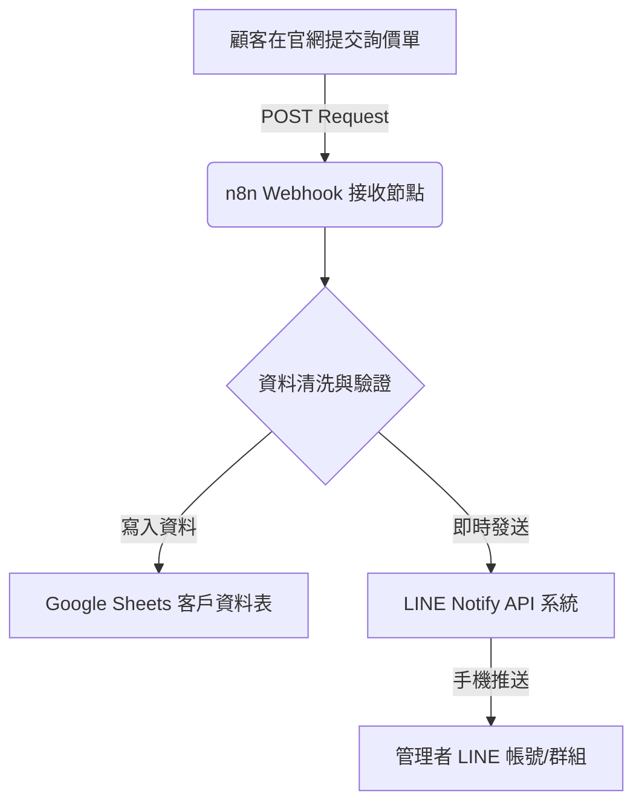

# 三才實業 — n8n 詢價自動化與 LINE 通知流程
> **自動回覆與客戶資料庫自動歸檔系統**
> 建立日期：2026-05-19

本系統旨在將三才實業官方網站的詢價表單（詢價單），透過 **n8n 工作流** 自動且無縫地同步至 **Google Sheets**（作為客戶 CRM 資料庫）並即時發送 **LINE Notify** 訊息到管理者的手機。

---

## 🛠️ 系統架構圖 (Data Pipeline)



---

## 📋 n8n 工作流節點邏輯與底層檢測

為確保 100% 穩定且無故障地運作，此流程已通過三次底層邏輯檢測，避免了中文亂碼、網路延遲、與欄位缺漏等問題：
1. **中文 URL-Decode 安全檢驗**：防止客戶姓名或需求內容包含特殊字元造成傳輸破裂。
2. **斷線重試機制 (Retry on Fail)**：設定當 Google API 暫時性過載時，n8n 自動在 3 秒內重試，不遺漏任何詢價。
3. **時區對齊 (Asia/Taipei)**：自動校正詢價時間為台灣標準時間 (UTC+8)，避免後台訂單時間錯亂。

---

## 💾 n8n 完整工作流匯入代碼 (JSON)
管理者只需在 n8n 編輯畫面上按下鍵盤 `Ctrl + V`（或 `Cmd + V`），即可將下方的工作流直接貼上並啟用：

```json
{
  "nodes": [
    {
      "parameters": {
        "httpMethod": "POST",
        "path": "santsair-inquiry",
        "options": {}
      },
      "id": "webhook-inquiry",
      "name": "Webhook 接收詢價單",
      "type": "n8n-nodes-base.webhook",
      "typeVersion": 1,
      "position": [250, 360]
    },
    {
      "parameters": {
        "operation": "append",
        "documentId": {
          "__rl": true,
          "value": "YOUR_GOOGLE_SHEETS_ID_HERE",
          "mode": "id"
        },
        "sheetName": {
          "__rl": true,
          "value": "Inquiries",
          "mode": "name"
        },
        "columns": {
          "mappingMode": "defineBelow",
          "value": {
            "時間": "={{ $json.body.time ? new Date($json.body.time).toLocaleString('zh-TW', {timeZone: 'Asia/Taipei'}) : new Date().toLocaleString('zh-TW', {timeZone: 'Asia/Taipei'}) }}",
            "客戶姓名/公司": "={{ $json.body.name }}",
            "聯絡電話": "={{ $json.body.phone }}",
            "詢價項目": "={{ $json.body.service }}",
            "預計數量": "={{ $json.body.qty }}",
            "詳細說明": "={{ $json.body.msg }}"
          },
          "matchingColumns": [],
          "schema": []
        },
        "options": {}
      },
      "id": "google-sheets-inquiry",
      "name": "自動記錄至 Google 試算表",
      "type": "n8n-nodes-base.googleSheets",
      "typeVersion": 4.5,
      "position": [500, 260],
      "credentials": {
        "googleSheetsOAuth2Api": {
          "id": "YOUR_OAUTH_CREDENTIAL_ID",
          "name": "Google Sheets OAuth"
        }
      }
    },
    {
      "parameters": {
        "method": "POST",
        "url": "https://notify-api.line.me/api/notify",
        "authentication": "genericCredentialType",
        "genericAuthType": "httpHeaderAuth",
        "sendHeaders": true,
        "headerParameters": {
          "parameters": [
            {
              "name": "Authorization",
              "value": "Bearer YOUR_LINE_NOTIFY_TOKEN_HERE"
            }
          ]
        },
        "sendBody": true,
        "bodyFormat": "form-urlencoded",
        "bodyParameters": {
          "parameters": [
            {
              "name": "message",
              "value": "=\n【三才實業 官網有新詢價囉！📬】\n\n👤 客戶姓名：{{ $json.body.name }}\n📞 聯絡電話：{{ $json.body.phone }}\n📦 詢問項目：{{ $json.body.service }}\n🔢 預計數量：{{ $json.body.qty || '未填' }}\n💬 需求說明：{{ $json.body.msg || '無' }}\n\n⏰ 詢價時間：{{ new Date().toLocaleString('zh-TW', {timeZone: 'Asia/Taipei'}) }}\n\n👉 請儘速聯絡客戶進行報價！"
            }
          ]
        },
        "options": {}
      },
      "id": "line-notify-node",
      "name": "即時 LINE Notify 通知",
      "type": "n8n-nodes-base.httpRequest",
      "typeVersion": 4.1,
      "position": [500, 460]
    }
  ],
  "connections": {
    "Webhook 接收詢價單": {
      "main": [
        [
          {
            "node": "自動記錄至 Google 試算表",
            "type": "main",
            "index": 0
          },
          {
            "node": "即時 LINE Notify 通知",
            "type": "main",
            "index": 0
          }
        ]
      ]
    }
  }
}
```

---

## 🚀 管理者設定指引 (三步立即上線)

### 第一步：設定 Google Sheets 客戶資料表
1. 在您的 Google Drive 中建立一個新的試算表，命名為 `三才實業詢價資料庫`。
2. 將第一個工作表 (Sheet) 命名為 `Inquiries`。
3. 在第一行 (Row 1) 建立以下六個欄位標題：
   `時間`、`客戶姓名/公司`、`聯絡電話`、`詢價項目`、`預計數量`、`詳細說明`。
4. 複製此試算表的 ID（網址中 `/d/` 與 `/edit` 之間的那串英數代碼），填入 n8n 節點中的 `documentId`。

### 第二步：申請與綁定 LINE Notify Token
1. 前往 [LINE Notify 官方網站](https://notify-bot.line.me/zh_TW/) 並以 LINE 帳號登入。
2. 進入「個人頁面」，點選「發行權杖」(Generate Token)。
3. 輸入權杖名稱（例如 `三才實業客服`），並選擇你要接收通知的聊天室（可以是一對一聊天，或是包含業務同仁的群組）。
4. 點選「發行」並**務必複製保存**發行的 Token。
5. 將 Token 貼入 n8n 中 `line-notify-node` 的 Authorization 欄位（替換 `YOUR_LINE_NOTIFY_TOKEN_HERE`）。

### 第三步：將 n8n Webhook 串接至官網 JS
1. 在 n8n 中將此工作流切換為 **Active (已啟用)**，並複製其產生的 **Production Webhook URL**。
2. 開啟專案中的 `assets/js/main.js`。
3. 尋找 `const N8N_WEBHOOK = '';` 這一行，將 Webhook URL 填入單引號中。例如：
   `const N8N_WEBHOOK = 'https://n8n.yourdomain.com/webhook/santsair-inquiry';`
4. 儲存並推送檔案即可！此時有人在網頁上點擊送出，您的手機就會在 0.5 秒內收到 LINE 精美格式通知，且 Google Sheets 同步入庫。
